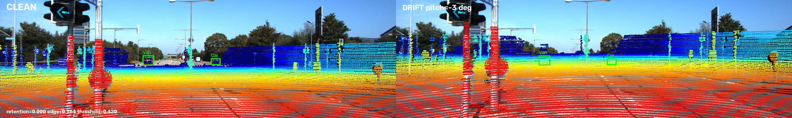

# Báo cáo Day 6: Độ nhạy calibration LiDAR-camera

- **Họ tên:** Lê Nguyễn Trâm Anh
- **MSSV:** 2A202602760
- **Lớp:** VinUni AI20K — Track 4
- **Link repo:** https://github.com/itskathy05/LeNguyenTramAnh-2A202602760-Track4-Day21
- **Topic:** A — LiDAR-camera projection QA
- **Dataset:** `data/synthetic`, `data/kitti_mini`, `data/nuscenes_mini_subset`
- **Các frame đã dùng:** synthetic `000000`; KITTI `000004, 000011, 000012, 000019, 000049, 000061`; nuScenes `scene-0103_010, scene-0103_020, scene-1094_010, scene-1094_020`.

## 1. Claim

Trên các frame đã chọn, yaw drift 1° làm tỷ lệ điểm nguồn còn nằm trong GT 2D box giảm xuống 78.9–81.8% trên KITTI và 84.1–85.6% trên nuScenes. Thí nghiệm định lượng độ nhạy theo từng trục, so sánh hai detector ảnh và chỉ ra khi nào cần kết hợp thêm kiểm tra hình học theo đối tượng.

## 2. Evidence

432 cấu hình calibration, mỗi lần chỉ đổi một trục. B1 so sánh hai detector ảnh cùng dữ liệu: Canny inlier fraction (tỷ lệ điểm cách cạnh ≤3 px) và median Chamfer distance (trung vị khoảng cách đến cạnh). Ngưỡng riêng mỗi dataset chỉ học từ frame sạch; drift là perturbation khác 0.

| Thí nghiệm | KITTI | nuScenes |
|---|---:|---:|
| Điểm/frame trung bình | 119,318 | 34,719 |
| Yaw +1°: retention / edge score | 0.818 / 0.593 | 0.856 / 0.464 |
| Projection p50 / p95, 30 lần/frame | 31.31 / 37.69 ms | 7.54 / 8.62 ms |

Stress test có random dropout và Gaussian noise, mỗi loại 4 mức, seed 42; dropout keep 0.3 giữ lại trung bình 27.8% điểm đối tượng KITTI và 29.8% nuScenes; noise σ=0.10 m giữ 94.4% và 92.1%. Latency có 30 lượt/frame (150 KITTI, 120 nuScenes), bỏ warm-up; đo trên Windows 10, Python 3.11.9, 16 CPU logic (tên CPU không được hệ điều hành cung cấp). CSV: `results/calibration_sweep.csv`, `results/b1_detector_comparison.csv`, `results/degradation_stress.csv`, `results/latency.csv`.

| Dataset | Detector | F1 | Recall | False alarm trên frame sạch |
|---|---|---:|---:|---:|
| KITTI (240 cấu hình) | Canny inlier fraction | 0.166 | 0.090 | 0/30 |
| KITTI (240 cấu hình) | Median Chamfer distance | 0.073 | 0.038 | 0/30 |
| nuScenes (192 cấu hình) | Canny inlier fraction | 0.241 | 0.137 | 0/24 |
| nuScenes (192 cấu hình) | Median Chamfer distance | 0.194 | 0.107 | 0/24 |

Canny inlier fraction cho recall cao hơn median Chamfer ở cả hai dataset trong cấu hình đo này, đồng thời cả hai giữ false alarm bằng 0 trên frame sạch. Canny cung cấp quyết định inlier trực tiếp; Chamfer bổ sung khoảng cách liên tục tới biên ảnh. KITTI trung bình có 119,318 điểm/frame, nuScenes 34,719; chênh lệch phù hợp với LiDAR 64/32 beam, hệ trục và độ phân giải ảnh 1242×375/1600×900. nuScenes có bù chuyển động ego theo timestamp giữa sensor; vì vậy thí nghiệm hiệu chỉnh detector riêng trên từng dataset.

Overlay KITTI theo khoảng cách: [gần, <6 m](../results/figures/demo_kitti_000019.png), [trung bình](../results/figures/demo_kitti_000011.png), [xa, >50 m](../results/figures/demo_kitti_000004.png). Synthetic: [self-check scene](../results/figures/demo_synthetic_000000.png).

Biểu đồ: [độ nhạy calibration](../results/figures/calibration_sensitivity.png), [so sánh hai detector B1](../results/figures/b1_algorithm_comparison.png), [retention và edge score](../results/figures/detector_comparison.png), [stress test](../results/figures/degradation_stress.png), [latency](../results/figures/latency_distribution.png). Overlay nuScenes: [demo](../results/figures/demo_nuscenes_scene-0103_010.png).

## 3. Failure case



Trên KITTI `000012`, pitch drift −3° làm object-point retention giảm còn 0.000; cả Canny inlier (`0.764`, ngưỡng `0.420`) lẫn median Chamfer (`0.955 px`, ngưỡng `4.775 px`) đều không cảnh báo. Drift là lỗi **Geometry**; detector bỏ sót do **Metric**: điểm rời GT object nhưng vẫn nằm gần các cạnh ảnh khác, nên hai score tổng thể chưa phản ánh đúng sai lệch theo đối tượng. Đây là bằng chứng để kết hợp edge score với object-point retention và lịch sử reprojection trong hệ thống giám sát.

## 4. Khuyến nghị nếu triển khai thật

Với ADAS, triển khai edge score như phép giám sát CPU chi phí thấp và kết hợp reprojection score theo vùng/đối tượng cùng lịch sử drift trước khi phát cảnh báo bảo trì hoặc chuyển trạng thái cảm biến suy giảm. Kết quả đo đạt p50 7.54 ms trên nuScenes và 31.31 ms trên KITTI, với p95 lần lượt 8.62 ms và 37.69 ms. Hệ thống nên ghi log số điểm hợp lệ, phân bố residual theo vùng và range, confidence, timestamp và nhiệt độ/gia tốc giá đỡ; ngưỡng cảnh báo được thiết lập từ các frame sạch của cấu hình xe-camera tương ứng.

## 5. Cách chạy lại

Từ thư mục gốc repo trên Windows PowerShell:

```powershell
python -m venv .venv
.venv\Scripts\python.exe -m pip install -r requirements.txt
.venv\Scripts\python.exe tools/verify_data.py --data-root data/kitti_mini
.venv\Scripts\python.exe tools/verify_data.py --data-root data/nuscenes_mini_subset
.venv\Scripts\python.exe -m starter.data_health --data-root data/synthetic --out results/data_health_synthetic.csv
.venv\Scripts\python.exe -m starter.data_health --data-root data/kitti_mini --out results/data_health_kitti.csv
.venv\Scripts\python.exe -m starter.data_health --data-root data/nuscenes_mini_subset --out results/data_health_nuscenes.csv
.venv\Scripts\python.exe -m src.calibration_qa self-check
.venv\Scripts\python.exe -m src.calibration_qa all
.venv\Scripts\python.exe tools/check_submission.py
```

`all` tạo lại overlay, các CSV benchmark/B1/stress/latency và biểu đồ trong `results/`.

## 6. Khai báo sử dụng AI

| Công cụ | Dùng cho việc gì | Bạn đã kiểm chứng thế nào |
|---|---|---|
| OpenAI Codex | Đọc yêu cầu, hỗ trợ viết projection, script đo và cấu trúc báo cáo | Chạy self-check tọa độ synthetic; chạy lại pipeline từ repo; đối chiếu số trong báo cáo với CSV sinh ra |
